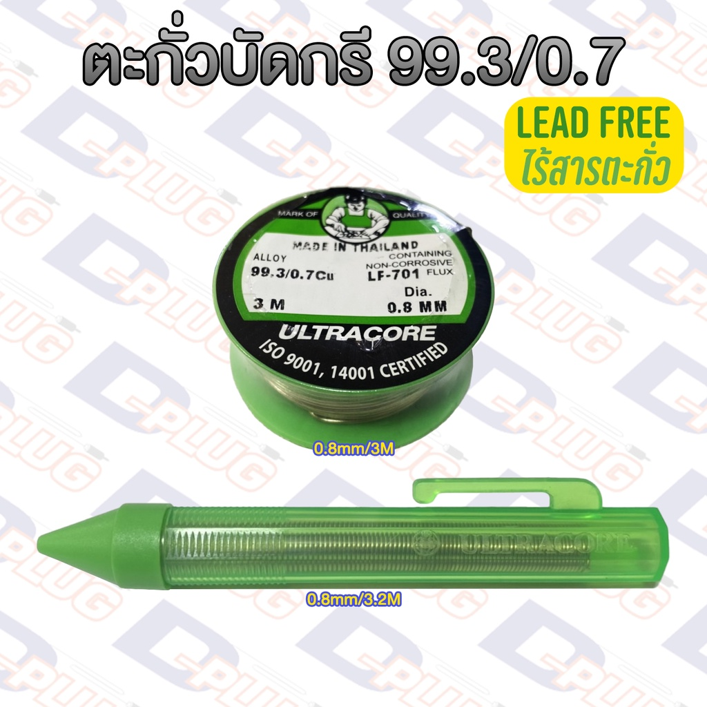

# References
### Transliteration
- [wikipedia en>th transliteration](https://th.wikipedia.org/wiki/%E0%B8%81%E0%B8%B2%E0%B8%A3%E0%B8%97%E0%B8%B1%E0%B8%9A%E0%B8%A8%E0%B8%B1%E0%B8%9E%E0%B8%97%E0%B9%8C)

### Butterflies
- [wingscales.com](https://wingscales.com/)
- [wingscales.com checklist](https://wingscales.com/Checklist/)
- [wikipedia หมวดหมู่:ผีเสื้อ](https://th.wikipedia.org/wiki/%E0%B8%AB%E0%B8%A1%E0%B8%A7%E0%B8%94%E0%B8%AB%E0%B8%A1%E0%B8%B9%E0%B9%88:%E0%B8%9C%E0%B8%B5%E0%B9%80%E0%B8%AA%E0%B8%B7%E0%B9%89%E0%B8%AD)
- [dnp.go.th](https://www.dnp.go.th/foremic/entomology/Web/Butterfly/pier_web/Ixias.htm)
- [thaibutterflies.com](https://thaibutterflies.com/)
- [thaibutterflies.com checklist](https://thaibutterflies.com/checklist/)

### Chutes & Mechanical
- [plastic water pipes joint naming references](https://buildmate.co.th/blog/pvc-joints/)
- [another plastic water pipes joint naming references](https://www.torpvc.com/pvc-fittings)
- [metal joints store for reference](https://www.thaiwatsadu.com/th/category/ข้อต่อเหล็ก-540407)
- [Archemedes' Screw translation](https://dict.longdo.com/search/Archimedes%20screw)
- [Gears](https://www.kacha.co.th/articles/%E0%B9%80%E0%B8%9F%E0%B8%B7%E0%B8%AD%E0%B8%87/)

### Armors
- [lamellar, chainmail discussion](https://topicstock.pantip.com/wahkor/topicstock/2010/11/X9931685/X9931685.html)
- [lamellar translation discussion](https://pantip.com/topic/42487349)
- [chinese armor wikipedia](https://en.wikipedia.org/wiki/Chinese_armour)

### Alcohol beverages
- [Mead info](https://www.foodnetworksolution.com/wiki/word/4255/mead)

### Plants
- [bamboo segments(culms) = ลำไผ่](https://www.bamboofarm.org/about-bamboo/)
- [reeds vs rush](https://thecontentauthority.com/blog/reed-vs-rush)
- in search for thai name for tules conclusion: theres none so transliteration it is

### Animals
- [goats](https://pasusat.com/แพะ/)
- [Thai dear names](https://th.wikipedia.org/wiki/%E0%B8%81%E0%B8%A7%E0%B8%B2%E0%B8%87)

### Food
- literally cannot find piemaking with making the outer layer without a mold so กรอบพาย it goes
- [cottage cheese making in thai](https://krua.co/cooking_post/homemadecottagecheese)

### Welding & Soldering
- [welding alloy](https://www.misterworker.com/th/stella-welding-alloys/soft-soldering-brazing-alloys/3476)
- In thai we just call solder wires "ตะกั่วบัดกรี" (lit. solder lead) you can check [this shop](https://shopee.co.th/%E0%B8%95%E0%B8%B0%E0%B8%81%E0%B8%B1%E0%B9%88%E0%B8%A7%E0%B8%9A%E0%B8%B1%E0%B8%94%E0%B8%81%E0%B8%A3%E0%B8%B5-%E0%B9%81%E0%B8%9A%E0%B8%9A%E0%B9%84%E0%B8%A3%E0%B9%89%E0%B8%AA%E0%B8%B2%E0%B8%A3%E0%B8%95%E0%B8%B0%E0%B8%81%E0%B8%B1%E0%B9%88%E0%B8%A7-(99.3-0.7)-%E0%B8%8A%E0%B8%99%E0%B8%B4%E0%B8%94%E0%B8%A1%E0%B8%B5%E0%B8%9F%E0%B8%A5%E0%B8%B1%E0%B8%81%E0%B8%8B%E0%B9%8C%E0%B9%83%E0%B8%99%E0%B8%95%E0%B8%B1%E0%B8%A7-Lead-Free-Solder-Wire-i.8895748.21304973441) out. they're literally selling leadless lead solder wire  how am i supposed to name silver solder help

### Metallurgy
- [recycling research center metallurgy technical words](http://www5.dpim.go.th/service7_1/)
- [villages does metallurgy blogpost](https://today.line.me/th/v2/article/WBnRxzR)
- [modern day metal casting post](https://ifoundryman.com/metal-casting/)
- [holy shit metallurgy website in thai after 1 whole day of finding only modern stuff tho](https://ifoundryman.com/)

### Buildings
- [Roofings namings](https://www.onestockhome.com/th/homemap_contents/36645773/roof-accessories)